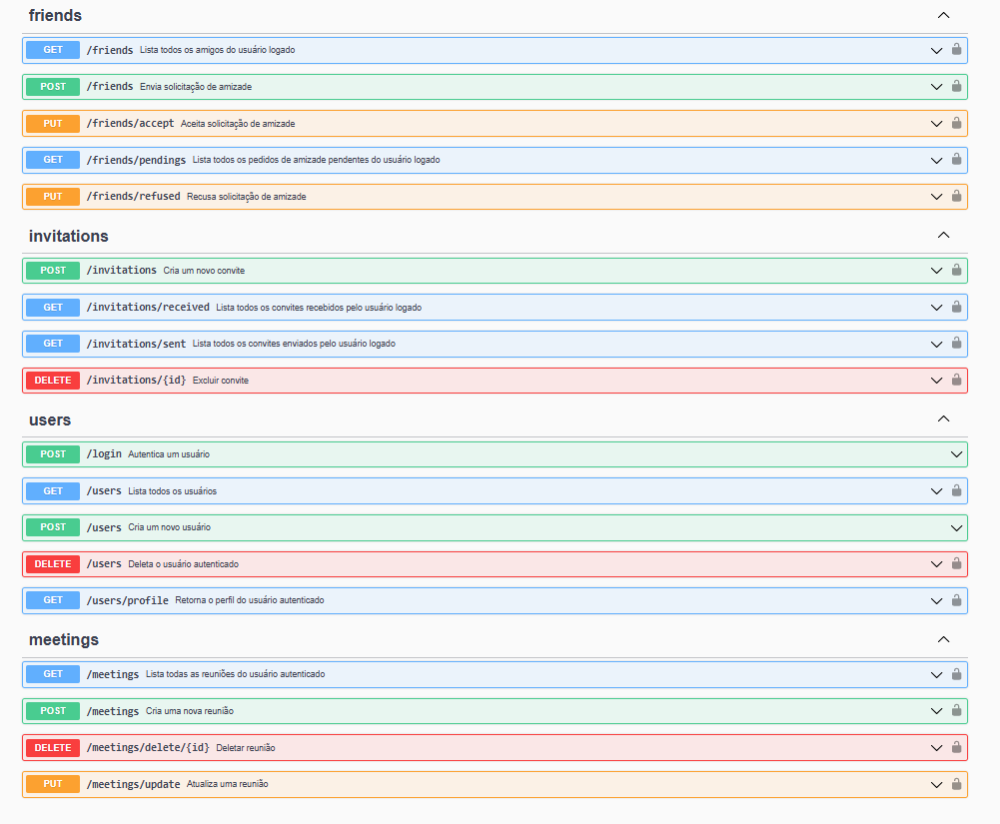

# Meeting Management API

A RESTful API built with Go **(Gin framework)** for managing users, meetings, invitations, and friends.  
Now with **real-time video sessions** powered by **WebRTC** and **WebSocket** integration.

---

## 📘 API Documentation

You can explore and test all endpoints through the Swagger UI:

👉 [Open Swagger UI](http://localhost:8080/api/v1/swagger/index.html)

> The documentation is automatically generated using **swaggo/gin-swagger**.

## 📸 Preview



## ✨ Features

- **Users**

  - Register, login, profile management
  - JWT-based authentication

- **Meetings**

  - Create, edit, list, and delete meetings
  - Time conflict validation (no overlapping schedules)
  - **Real-time video/audio communication via WebRTC**

- **Invitations**

  - Send and receive invitations
  - Email notifications for invitations
  - Accept or decline meeting invites

- **Friends**

  - Search and add users to your friends list
  - Accept or reject friend requests

- **Dashboard**
  - List all meetings of the logged-in user

---

## ⚡ Real-Time Communication

The project now includes **WebRTC** integration for peer-to-peer communication and **WebSocket** signaling for message exchange.

### How it works

1. Clients connect to `/ws/:meetingID/:userID` through WebSocket.
2. The server handles signaling between peers (offer, answer, ICE candidates).
3. WebRTC establishes a direct connection for video/audio streaming.

**Example WebSocket payload:**

```json
{
  "type": "offer",
  "meetingID": 1,
  "userID": 1,
  "data": "SDP_EXAMPLE"
}
```

## 🗄️ Database Schema

**Users Table**

- `id` (PK)
- `name`
- `email`
- `password` (hashed)
- `created_at`

**Meetings Table**

- `id` (PK)
- `title`
- `description`
- `start_time`
- `end_time`
- `owner_id` (FK → users.id)
- `created_at`

**Invitations Table**

- `id` (PK)
- `meeting_id` (FK → meetings.id)
- `user_id` (FK → users.id)
- `status` (pending / accepted / declined)
- `created_at`

**Friends Table**

- `id` (PK)
- `user_id` (FK → users.id)
- `friend_id` (FK → users.id)
- `status` (pending / accepted / declined)

---

## 🛠️ Technologies

- **Backend:** Go + Gin
- **Database:** PostgreSQL
- **Authentication:** JWT
- **Email Notifications:** SMTP
- **ORM/DB Access:** database/sql \* native queries
- **Real-Time Communication:** WebRTC + WebSocket
- **API Documentation:** Swagger (via swaggo/gin-swagger)
- **Enviroment Configuration:** .env + godotenv

---

## ⚙️ Setup

### Clone the repository

```bash
git clone https://github.com/jhonnydsl/gerenciamento-de-reunioes.git
cd gerenciamento-de-reunioes

# Create a .env file in the project root:

## Database
DB_HOST=localhost
DB_PORT=5432
DB_USER=your_user
DB_PASS=your_password
DB_NAME=meeting_db

## SMTP (for email invitations)
SMTP_HOST=smtp.yourprovider.com
SMTP_PORT=587
SMTP_USER=youremail@example.com
SMTP_PASS=yourpassword

## JWT
JWT_SECRET=your_secret_key
```

## Contato

- Email: jhonny.s.l.12345@gmail.com
- LinkedIn: www.linkedin.com/in/jhonny-da-silva-lima-354a6a16b
- GitHub: https://github.com/jhonnydsl
